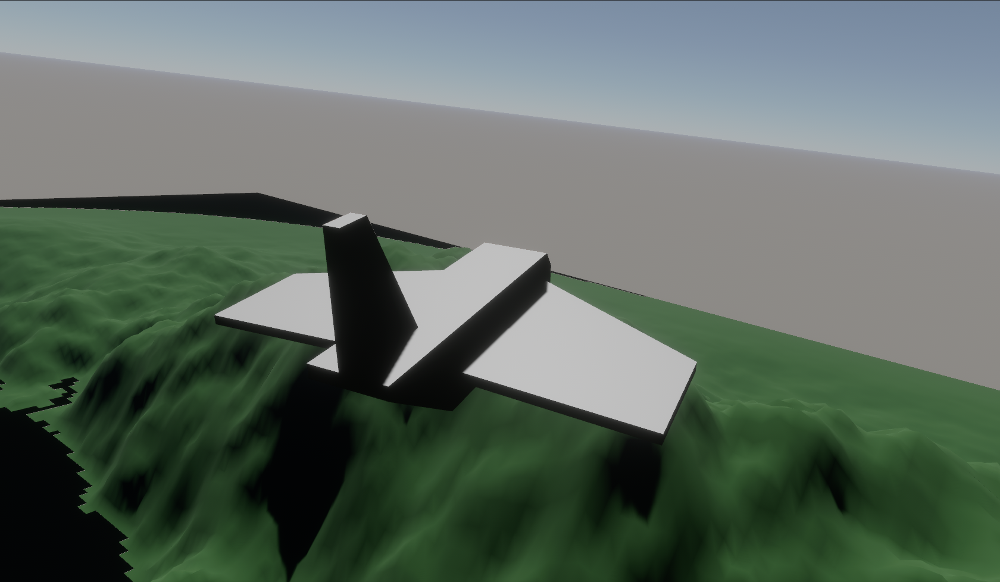

# bevy-fs

This is a little flight sim made in bevy. Currently it doesn't do much, but I plan to make some more commits.
The game has support for both keyboard and gamepad input.

### Controls

#### If gamepad connected

> Note: Works only when exactly one gamepad is connected

- Left stick to steer
- `RMB + drag` to orbit
- `R` to reset camera

#### If no gamepad connected

- `WASD` to steer
- `RMB + drag` to orbit
- `R` to reset camera
- `PgUp` and `PgDown` to throttle up and down respectively

